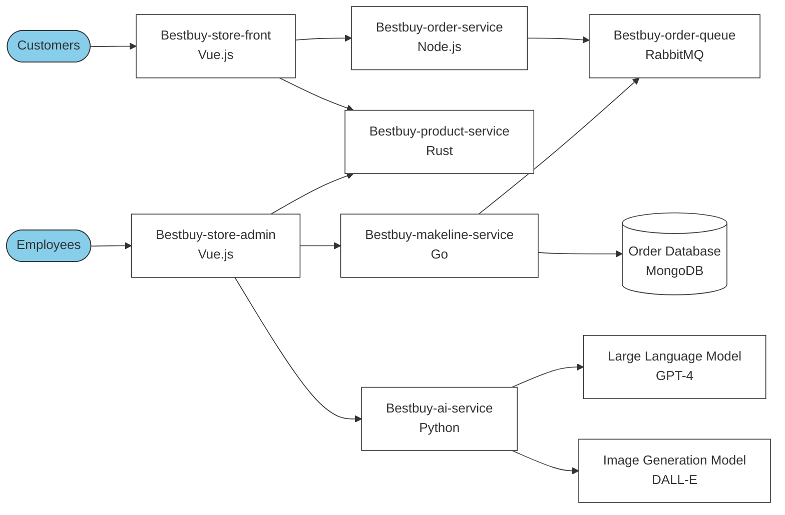

# Full-Stack Cloud-Native Development  

## **Updated Application Architecture**  


# Application and Architecture Explanation

## Application Functionality
The application is a microservices-based architecture designed to handle different aspects of an e-commerce system for BestBuy. It involves customer interaction (store-front), employee management (store-admin), and backend services for processing orders, managing products, and providing AI functionalities.

## Architecture Explanation

1. **User Interactions**:
   - **Customers** interact with the `store-front` application (built with Vue.js) to browse and purchase products.
   - **Employees** use the `store-admin` application (also built with Vue.js) to manage orders, products, and the backend services.

2. **Backend Services**:
   - **BestBuy-order-service (Node.js)**: Handles customer orders, communicates with RabbitMQ (`BestBuy-order-queue`), and ensures reliable order processing.
   - **BestBuy-product-service (Rust)**: Manages product-related data and inventory.
   - **BestBuy-makeline-service (Go)**: Handles order processing and preparation, interacting with the order database.

3. **Asynchronous Communication**:
   - **RabbitMQ (BestBuy-order-queue)**: Ensures asynchronous communication between services, particularly for order processing and coordination.

4. **Database**:
   - **Order Database (MongoDB)**: Stores all order-related data for processing, analytics, and consistency.

5. **AI and Image Processing**:
   - **BestBuy-ai-service (Python)**: Provides advanced functionalities such as customer assistance using a Large Language Model (GPT-4) and generates product images using an Image Generation Model (DALL-E).

## **Step by Step Instructions to deploy the application in a  Kubernetes cluster**  
 1. As prerequisite you need to fork this repository [GitHub Link](https://github.com/meinai-otoko/Assignment2-Full-Stack) 
 2. You need to deploy a AKS cluster with one master node and two worker nodes.
 3. To enable AI-generated product descriptions and image generation features, you will deploy the required Azure OpenAI Services for GPT-4 (text generation) and DALL-E 3 (image generation). This step is essential to configure the AI Service component in the Best buy application.
 4. You then need to base64 Encode the API key which can be found in Keys and Endpoint section of the Azure OpenAI Resource.
 5. Update the secrets.yaml file with the encoded API key.
 6. Update the `aps-all-in-one.yaml` File
To configure the `aps-all-in-one.yaml` file, replace the placeholders with the retrieved configurations as follows:
- **`AZURE_OPENAI_DEPLOYMENT_NAME`**: Enter the deployment name for GPT-4.
- **`AZURE_OPENAI_ENDPOINT`**: Enter the endpoint URL for the GPT-4 deployment.
- **`AZURE_OPENAI_DALLE_ENDPOINT`**: Enter the endpoint URL for the DALL-E 3 deployment.
- **`AZURE_OPENAI_DALLE_DEPLOYMENT_NAME`**: Enter the deployment name for DALL-E 3.
 7.  Deploy the ConfigMaps and Secrets
- **Deploy the ConfigMap for RabbitMQ Plugins:**
    ```bash
    kubectl apply -f config-maps.yaml
    ```
- **Create and Deploy the Secret for OpenAI API:**
    - Make sure that you have replaced `Base64-encoded-API-KEY` in `secrets.yaml` with your Base64-encoded OpenAI API key.
    ```bash
    kubectl apply -f secrets.yaml
    ```
- **Verify:**
    ```bash
    kubectl get configmaps
    kubectl get secrets
    ```
8. Deploy the application
```bash
kubectl apply -f aps-all-in-one.yaml
```
## Table of Microservices Repositories
| Service           | Repository Link     |
|-------------------|---------------------|
| Store-Front       | [GitHub Link](#)    |
| Order-Service     | [GitHub Link](#)    |
| Product-Service   | [GitHub Link](#)    |
| Store-Admin       | [GitHub Link](#)    |
| Makeline-Service  | [GitHub Link](#)    |
| AI-Service        | [GitHub Link](#)    |
| Virtual Customer  | [GitHub Link](#)    |
| Virtual Worker    | [GitHub Link](#)    |


2. A **Deployment Files** subfolder:  
   - Include all Kubernetes deployment YAML files in a folder named `Deployment Files`.  
   - Ensure these files are clearly named (e.g., `store-front-deployment.yaml`, `order-service-deployment.yaml`).   

### **2. Demo Video**  
Record a **5-minute max demo video** showcasing the following:  
- The application in action after deployment to AKS cluster.  
- AI-generated product descriptions and images.  
- Integration with the managed order queue service.  

**Upload the video to YouTube** and include a link to the video in your `README.md` file under a "Demo Video" section.  

---

## **Grading Criteria**  

| **Criteria**                           | **Weight** |
|----------------------------------------|------------|
| Application Code and Documentation     | 20%        |
| Integration with Managed Order Queue   | 20%        |
| AI Integration (GPT-4 and DALL-E)      | 20%        |
| Kubernetes Deployment                  | 20%        |
| Demo Video                             | 20%        |

---

## **Resources**  
- **Algonquin Pet Store Repository:** [GitHub Link](https://github.com/ramymohamed10/algonquin-pet-store-on-steroids)  
---

## **Submission Instructions**  
1. Push your code and deployment files to your GitHub repository.  
2. Submit the GitHub repository link via Brightspace.  

--- 

### **Bonus Task: Implement a CI/CD Pipeline for Each Microservice (2 Bonus Marks)**  
Set up a **Continuous Integration/Continuous Deployment (CI/CD) pipeline** for all microservices to automate building, and deploying the application.


